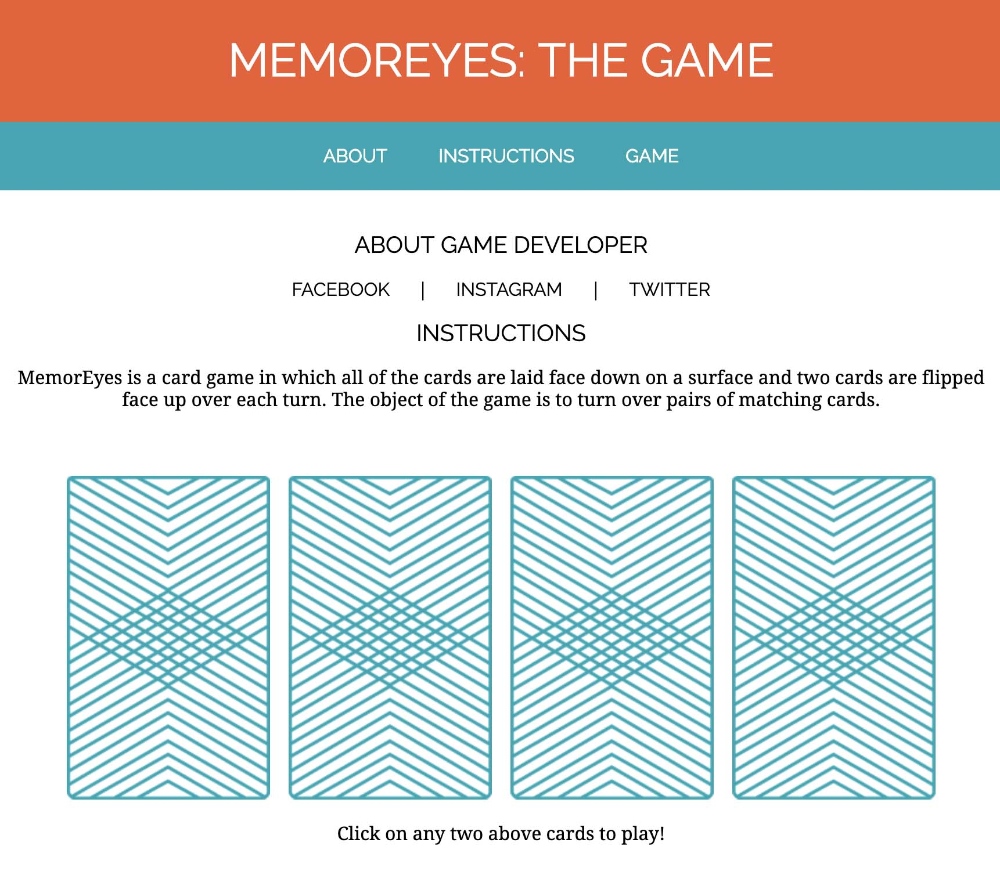

# MemorEyes

MemorEyes is a card game in which all of the cards are laid face down on a surface and two cards are flipped face up over each turn. The object of the game is to turn over pairs of matching cards.

This simple game app was adapted from General Assembly's [Dash](https://dash.generalassemb.ly/) learning curriculum.