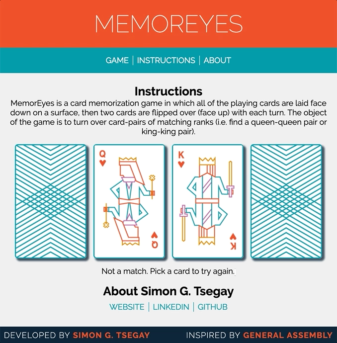

# MemorEyes

MemorEyes is a card game in which all of the cards are laid face down on a surface and two cards are flipped face up over each turn. The object of the game is to turn over pairs of matching suit cards.

The idea for this simple game app was adopted from General Assembly's [Dash](https://dash.generalassemb.ly/) learning curriculum.

## Getting Started

There are no dependencies for this app. Simply download / clone this repo to your local machine, open `index.html`. It is currently desktop-ready, best viewed with at least 640px width and 668px height.

## Features

* Board resets per round with shuffled cards.
* Result of each game is displayed within the prompt to play again.

## Backlog

* Detect when the same card is clicked twice, and tell user to pick again. ✓
* Get the second card to show that it's flipped over. ✓
* Disable card flipping after the game is over. ✓
* Use modals instead of confirm alerts.
  * http://kanecohen.github.io/modal-vanilla/
  * Add a game restart button within the modal.
* Implement a way to keep track of and display the user's score.
* Test for mobile responsiveness.
  * Create breakpoints for widths < 640px.
  * Create breakpoints for height < 480px.